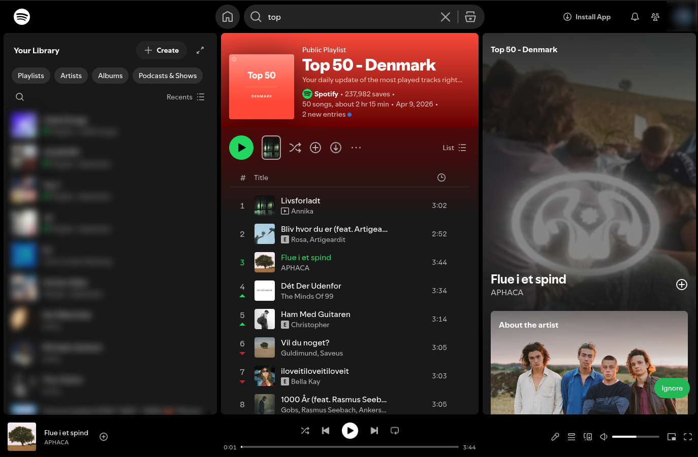
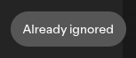

# Spoti-Ignore

A Chrome/Chromium browser extension that lets you instantly tell Spotify to stop recommending a song — using Spotify's own built-in "Ignore in recommendations" API.

No third-party servers. No account required beyond your normal Spotify login. Just a button.

<!-- Screenshots — drop images into the screenshots/ folder and uncomment these lines:


-->





---

## Features

- **One-click ignore** — A floating button on the Spotify Web Player lets you ignore any playing track.
- **Keyboard shortcut** — Press **Shift + X** to ignore the current track without touching the mouse.
- **Live status detection** — The button shows a loading state while tokens are being captured and turns green once everything is ready.
- **Duplicate-ignore protection** — If a track is already in your ignore list the button updates automatically to reflect that.

---

## Installation

The extension is not published to the Chrome Web Store; you load it directly from this repository.

### 1. Download the extension

Clone or download this repo:

```bash
git clone https://github.com/z-designs/spoti-ignore.git
```

Or download the ZIP from GitHub and extract it.

### 2. Open the Chrome extensions page

Navigate to `chrome://extensions` in your browser (works in Chrome, Brave, Edge, and other Chromium-based browsers).

### 3. Enable Developer Mode

Toggle **Developer mode** on — the switch is in the top-right corner of the extensions page.

### 4. Load the extension

Click **Load unpacked** and select the **`extension/`** folder inside this repository.

The Spoti-Ignore icon will appear in your browser toolbar.

### 5. Open Spotify Web Player

Go to [open.spotify.com](https://open.spotify.com) and start playing a song. A green **Ignore** button will appear in the bottom-right corner of the page after a few seconds once the extension has captured the required tokens.

### 6. Enter your Spotify User ID (first time only)

The first time you click Ignore you will be prompted for your **Spotify User ID**. You can find it:

- In the URL of your profile page on Spotify Web Player (e.g. `open.spotify.com/user/abc123xyz`)
- Or by running the following snippet in the browser console while on open.spotify.com:
  ```js
  Object.keys(localStorage).filter(k => k.includes('userid')).map(k => localStorage.getItem(k))
  ```

Your ID is stored in `localStorage` and only asked for once.

---

## How it works

The extension injects a content script into `open.spotify.com` that:

1. Intercepts outgoing `fetch` and `XHR` requests to capture the Bearer and Client tokens Spotify already uses internally.
2. Detects the currently playing track URI from the DOM.
3. When you click **Ignore**, it calls `spclient.wg.spotify.com/collection/v2/write` with your user ID and the track URI — the same endpoint Spotify's own right-click menu uses.

Your credentials never leave Spotify's own infrastructure.

---

## Roadmap

- [ ] **Auto-skip** — Automatically skip to the next track when an ignored song starts playing.
- [ ] **Ignore stats** — Show a counter of how many songs you have ignored in the current session and all-time.
- [ ] **Unignore** — If you ignored a song by mistake, add a way to reverse it without leaving the web player.
- [ ] **Easy user ID setup** — Instead of asking for the Spotify User ID on first use, try to capture it automatically from the page or Spotify's own API responses or by navigating the user to the spotify profile page and scraping it from the URL.

---

## Disclaimer

This project was built with assistance from AI (GitHub Copilot / Claude). The code has been reviewed and tested by the author, but use it at your own discretion. Spoti-Ignore is an independent hobby project and is not affiliated with, endorsed by, or connected to Spotify AB in any way.

---

## License

[MIT](LICENSE)

